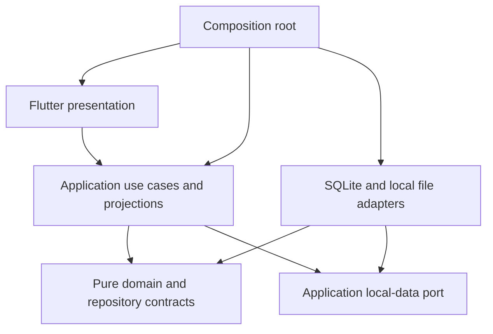

# Architecture review — 18 September 2026

Base: `cfe6f7b7f2cb16e75a42e82d76ce86500eb757b6` (main, PR #209).
Scope: local architecture audit and behavior-preserving cleanup requested by the owner. There is no linked implementation issue or new product requirement. No schema, financial default, rule definition/version, network service, account requirement, or AI dependency is introduced.

## Assessment

The existing package direction is sound: domain models and repository contracts are pure Dart; application use cases depend on domain; the database package implements persistence; Flutter composes adapters and presents results. SQLite remains the local system of record. The weaknesses were concrete dependencies leaking into presentation, duplicated decimal operations, rule-ID-driven UI selection, and gaps in automated boundary enforcement. This change addresses those weaknesses; it does not claim that every large screen or platform integration is fully decoupled.

Arrows represent source dependencies; the composition root injects concrete adapters into application services. File picker and share-sheet presentation remain platform UI responsibilities.

## Implemented changes and verification map

| Concern | Change | Verification |
| --- | --- | --- |
| UI/storage separation | Privacy and recovery screens use `WorkspaceDataService` and pure result types. `LocalDataGateway` owns the storage contract; the local adapter owns files and backup/database managers. DI owns seed refresh. | Application orchestration tests; real SQLite backup/restore recovery contract test; recovery-screen tests; import boundary tests. |
| Failure semantics | Runtime seed refresh remains inside the restore/recovery safety gate; a refresh failure must not announce success or release recovery mode. | `local_backup_design_contract_test.dart` traverses the application service, adapter, manager and SQLite; unit tests verify refresh order and propagation. |
| UI/application separation | Dashboard output selection and quality aggregation live in `AnalysisOverview`. Selection uses declared semantic roles/surfaces instead of bundled rule IDs. | Projection tests with different valid IDs, large exact values and failed evaluations; existing analysis-page tests. |
| Exact arithmetic | Domain `DecimalValue` owns addition, subtraction, multiplication, absolute value and summation; normalization, analysis and statement aggregation reuse it. | Mixed-scale, negative, cancellation, empty and large-number tests plus existing engine/database suites. |
| UI financial calculation | Pie legend reads the rule result's source amount instead of reconstructing money from its rounded percentage. | Widget regression: 33.33% of 300 must display source amount 100, not 99.99. |
| Hardcoded policy | Named reconciliation weights, injectable statement-intake defaults and shared backup/password protocol constants replace duplicated literals. Existing policy values remain unchanged. | Statement default/explicit-value and threshold tests; reconciliation suites; encrypted/legacy backup contracts. |
| Shared catalog | Pure master-data label catalog is shared from configuration, rather than presentation exporting a database module. | Existing localized label/seed tests and new presentation boundary gate. |
| Architectural regression prevention | AST-based checks cover imports, exports, conditional imports and parts, including relative paths; gates cover domain, application, database and presentation. | Boundary-policy adversarial fixtures and all four package gates. Analyzer is a development-only dependency. |

“Remove hardcoded values” is applied to business policy, identities, duplicated defaults and protocol metadata. Mathematical constants, enum values, localized resource keys and explicit compatibility versions are not arbitrary runtime configuration. Changing financial defaults or persisted protocol versions would require a separate approved decision.

## Coverage baseline

Collected before refactoring from all three Dart package suites and the Flutter suite with `--coverage-package='butlerly.*'`. LCOV records were normalized to repository paths and covered line hits unioned across suites, so indirect domain/database execution is counted once.

| Layer | Covered / instrumented executable lines | Coverage |
| --- | ---: | ---: |
| Domain | 399 / 543 | 73.5% |
| Application | 2,696 / 3,194 | 84.4% |
| Database | 1,416 / 1,729 | 81.9% |
| Flutter app | 9,752 / 12,824 | 76.0% |

Baseline: 754 passing tests (28 domain, 160 application, 43 database, 523 Flutter). These are line-coverage measurements, not branch coverage or proof of requirements completeness. Native integration journeys are excluded from these percentages. Never-loaded source may not be represented in the executable-line denominator.

Low-coverage areas in the baseline include first-use preferences (1/92), recovery screen (1/74), privacy controls (44/288), contextual pages (62/341), analysis preview (0/9) and native database factory (0/5). This change adds recovery-screen failure/retry and destructive-confirmation tests, production restore-gate coverage, projection and exact-arithmetic coverage. Platform pickers/share sheets still require native/device verification.

## Remaining improvements

1. Split transaction, home and statement screens along coherent state/controller and reusable view boundaries when those flows next change. Their size is a maintenance concern; splitting by line count alone would add indirection without improving ownership.
2. Inject the existing application clock consistently into analysis installation/lifecycle and reconciliation writes. Some timestamp creation still calls `DateTime.now`; current tests cover behavior but deterministic time control is incomplete.
3. Expand privacy UI tests around picker cancellation, invalid passwords, export failures and native share completion. Adapter tests do not prove every native UI path.
4. Reduce the broad `FinanceServices` facade and service-locator coupling over time through feature-scoped dependencies. Database constructors remain confined to composition/infrastructure, but screens still obtain use cases through the shared facade.
5. Audit remaining feature-specific defaults and duplicate-detection policy separately. Keep duplicate identity checks distinct from fuzzy receipt/payment reconciliation: they answer different questions despite similar inputs.
6. Maintain platform CI: web compilation cannot validate SQLite/file restoration, camera/OCR plugins, share sheets or Android Gradle/native integration.

No speculative framework, module, remote configuration service or generic repository abstraction is added. Existing persistence interfaces already provide the necessary domain boundary.

## Validation and review

Self-review cycle 1 covered requirements, integration, persisted compatibility and adversarial regressions. It identified a relative UI-to-seed export and metadata-incomplete category fixtures; the shared catalog and fixture corrections are included.

Cycle 2 retraced bootstrap, restore, recovery, erase, rule selection and decimal consumers. It found that recovery-service registration must survive database-open failure. Registration is now unconditional, and `workspace_registration_test.dart` covers the unavailable-database case.

Cycle 3 reviewed the resulting complete diff and callers again, including restore refresh ordering, existing schema/backup compatibility, declarative roles after SQLite reconstruction, failure states and localization. No further consequential in-scope defect was identified by self-review.

Final canonical validation passed: `./tool/validate.sh` with the Flutter and Dart versions pinned in [`tool/toolchain.env`](../../tool/toolchain.env) at the reviewed commit, zero formatter changes, no static-analysis issues, 32 domain + 44 database + 171 application + 528 Flutter tests (775 total), and the web build. `git diff --check` passed.

All seven iOS simulator integration journeys passed using `BUTLERLY_IOS_DEVICE_ID=613A1429-7ADD-41D5-8242-83D2C6D14396 ./tool/validate.sh integration_test`. They exercise first-use preferences, transaction creation/restart, CSV import/duplicates, receipt evidence/reconciliation, search/edit/analysis/export/erase, and recoverable unsupported OCR.

Fresh independent review ran in a separate context with only the owner requirements, repository instructions/approved sources, complete implementation/test diff and raw validation evidence. It returned **no actionable P0/P1/P2 findings**. Reviewed state: base `cfe6f7b7f2cb16e75a42e82d76ce86500eb757b6` plus the staged implementation diff; SHA-256 of `git diff --cached --binary <base> -- . ':(exclude)docs/03 Engineering/architecture-review-2026-09-18.md'` was `a65225673fa9bfdc7a1aac1c842216e8b65a66d4581c12ba248e2ea28b2f4206`. The reviewer completed before native integration ended; the iOS result above is subsequent local validation, not an independent post-PR merge approval.

Android could not be verified locally because its SDK is absent. Linux and Windows native builds require their respective environments. The macOS debug build passed with Flutter's automatic deployment-target adjustment to 12.0. That generated Xcode project adjustment was reverted to preserve the repository's declared 10.15 target. This does not establish compatibility with macOS 10.15–11; aligning the declared minimum with the pinned Flutter toolchain remains a platform-support decision. Dependency deprecation warnings did not fail the build. Generated lockfiles and platform registrants in this isolated checkout are refreshed by the repository setup/toolchain; the six pre-existing modified files in the owner's original checkout were not edited.

## Post-review restore compatibility correction — 19 September 2026

PR #210's independent review identified that replacing data with an older schema-v8 backup can reactivate historical rules lacking semantic roles. The new overview projection then omits summary metrics until application restart. The original fresh review did not catch this persisted-version case.

The workspace system refresh now installs and activates the current packaged rule catalog after seeding master data and before refreshing presentation, inside the existing restore/recovery safety gate. Invalid or unavailable rule installation fails the gate. Historical definitions are retained unchanged, and existing disabled activations remain disabled. No bundled definition or schema is modified.

`workspace_restore_rules_test.dart` exercises actual dependency configuration, SQLite repositories, backup creation/restore, asset installation and analysis calculation using historical rule fixtures copied from commit `808305e`. It covers merge/replace refresh without restart, unchanged historical hashes/definitions, disabled activations, and installation failure preserving the recovery gate and financial records. The replace regression fails with the refresh fix removed; all four tests pass with it applied.

The owner explicitly requested local review/validation and commit/push without waiting for subsequent GitHub CI results. Remote results on the next pushed head are therefore not claimed here.

A new separate-context review of this correction and its relevant callers found no actionable P0/P1/P2 findings. Local validation covers 779 tests (including the four new production restore tests), static analysis, formatting and the web build; the final committed tree is checked again before push.

## Follow-up — consolidated P0 correctness remediation (19 September 2026)

PR #214 consolidates the useful P0 correctness work that had been split across
the earlier #211 and #212 branches. The current implementation follows the
latest PRD-0003 v1.1 semantics rather than older audit interpretations.

- **Database-owned catalog:** `database/seed/catalog.sql` is the runtime source
  of truth for Butlerly-owned master/reference seed data and persisted
  translations. Restore/erase recovery reseeds through the database asset,
  presentation reads persisted translations through application/repository
  APIs, and duplicate Dart category/tag/merchant/reference catalogs are
  removed. Reseeding restores missing system rows/translations without
  overwriting archived system state or user-created master data. English,
  Simplified Chinese, and Spanish category/tag translations remain
  database-owned.
- **Statement intake:** missing extracted currency or direction remains unknown
  rather than being filled with USD/expense. Candidates lacking minimum
  financial validity remain attached to the statement for correction instead
  of becoming canonical transactions.
- **Statement batch semantics:** PRD-0003 FIN-108–115 is authoritative.
  Batch confirmation may persist minimum-valid statement rows without
  transaction-by-transaction confirmation. Low-confidence/unresolved
  exceptions enter Needs Review, possible duplicates are persisted in
  Review → Possible Duplicates, and unaffected rows complete normally.
- **Structured CSV duplicate checks:** CSV candidates use the shared
  `DuplicateTransactionChecker`. A FIN-095 duplicate requires explicit
  confirmation before a separate canonical transaction is created.
- **Statement document intake:** Statement Capture supports existing image/file
  selection in addition to camera/photo acquisition. PDF is exposed only on
  platforms where the native OCR adapter supports PDF input; Android currently
  remains image-only for statement file OCR.

- **Merchant classification:** Butlerly keeps one deterministic default
  classification per merchant (`Merchant → Subcategory → Category`). Broad
  merchant identities remain valid while materially distinct service contexts
  may be represented as specific variants such as `AT&T Wireless`,
  `Costco Gas`, and `Safeway Pharmacy`. Specific variants take precedence
  only when supported by source evidence; otherwise matching falls back to the
  broad merchant. Store numbers and formatting variations are normalization
  concerns rather than new merchant identities. The detailed contract is in
  `docs/03 Engineering/merchant-classification-contract.md`.
- **Built-in catalog upgrades:** New built-in rows remain compatible with
  idempotent seeding. Future changes to existing built-in merchant meaning must
  use an explicit catalog upgrade/database migration path rather than relying
  on `INSERT OR IGNORE`, with production-path migration coverage.

These changes do not introduce a schema-version change, cloud dependency,
mandatory account, or AI dependency.
